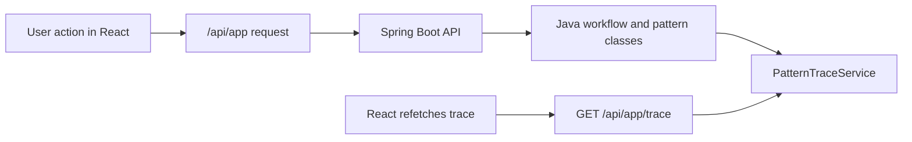

# React Frontend Implementation Plan

## Recommended Setup
- Use **Vite + React + TypeScript** under `[frontend](frontend)`.
- Use **React Router** for screen navigation.
- Use **plain fetch wrapper** first; optionally add TanStack Query later if server state becomes noisy. For this MVP, keep dependencies minimal.
- Use **CSS Modules or plain global CSS** with design tokens copied from Figma guidance. Avoid adopting the generated Figma app wholesale; use it only as visual reference.
- Use Vite dev proxy so the frontend can call `/api/app/...` without CORS changes.

Recommended packages:
- `react`, `react-dom`, `vite`, `typescript`
- `react-router-dom`
- Test stack: `vitest`, `@testing-library/react`, `@testing-library/user-event`, `jsdom`

## Proposed Folder Structure
```text
frontend/
  package.json
  index.html
  vite.config.ts
  tsconfig.json
  src/
    main.tsx
    App.tsx
    styles/
      tokens.css
      global.css
    api/
      client.ts
      types.ts
      dashboardApi.ts
      usersApi.ts
      coursesApi.ts
      assignmentsApi.ts
      submissionsApi.ts
      feedbackApi.ts
      traceApi.ts
    app/
      routes.tsx
      AppShell.tsx
    components/
      layout/
        Header.tsx
        Sidebar.tsx
        PageHeader.tsx
      common/
        Button.tsx
        Card.tsx
        EmptyState.tsx
        ErrorBanner.tsx
        Loading.tsx
        StatusBadge.tsx
      trace/
        TracePanel.tsx
        TraceFilters.tsx
        TraceEventList.tsx
    pages/
      DashboardPage.tsx
      CoursesPage.tsx
      CourseBuilderPage.tsx
      StudentRosterPage.tsx
      AssignmentsPage.tsx
      SubmissionsPage.tsx
      StudentFeedbackPage.tsx
      FullTracePage.tsx
    state/
      appSelection.tsx
    test/
      renderWithRouter.tsx
```

## API Client Structure
`[frontend/src/api/client.ts](frontend/src/api/client.ts)` should expose a small typed wrapper:
- `apiGet<T>(path: string, params?: Record<string, string | undefined>): Promise<T>`
- `apiPost<TRequest, TResponse>(path: string, body?: TRequest): Promise<TResponse>`
- Parse Spring error JSON and throw a UI-friendly `ApiError` with `status`, `message`, and `path`.

`[frontend/src/api/types.ts](frontend/src/api/types.ts)` should mirror Java DTOs:
- `UserResponse`, `DashboardResponse`, `PatternResponse`, `TraceEventResponse`
- `CourseResponse`, `CourseDetailResponse`, `RosterResponse`
- `CreateAssignmentRequest`, `AssignmentResponse`, `RubricResponse`
- `CreateSubmissionRequest`, `SubmissionDetailResponse`, `AnalysisResponse`, `AIAnalysisReportResponse`
- `FeedbackDraftResponse`, `FinalFeedbackResponse`, `StudentFeedbackResponse`

Keep enum values as backend strings:
- `PDF_TEXT`, `JAVA_CODE`
- `RUBRIC_WEIGHTED`, `PASS_FAIL`, `CODE_TEST`
- `SUBMITTED`, `AWAITING_REVIEW`, `FINALIZED`

## Page Mapping To Figma Screens
- `01-dashboard-app.png` → `DashboardPage`
  - Calls `GET /api/app/dashboard`, `GET /api/app/trace?search=` optionally for recent trace.
  - Shows counts and instructor identity from backend only.

- `02-courses-list.png` → `CoursesPage`
  - Calls `GET /api/app/courses`.
  - Creates course through `POST /api/app/courses`.

- `03-course-builder-new-course.png` → `CourseBuilderPage`
  - Uses `POST /api/app/courses` for new course.
  - Uses `POST /api/app/courses/{courseId}/assignments` for assignment/rubric creation.

- `04-student-roster.png` → `StudentRosterPage`
  - Calls `GET /api/app/students`, `GET /api/app/courses/{courseId}/roster`.
  - Enrolls through `POST /api/app/courses/{courseId}/enrollments`.

- `05-assignments.png` → `AssignmentsPage`
  - Calls `GET /api/app/courses/{courseId}/assignments`.
  - Calls `GET /api/app/assignments/{assignmentId}` for detail.

- `06-submissions.png` → `SubmissionsPage`
  - Calls `GET /api/app/assignments/{assignmentId}/submissions`.
  - Creates submissions through `POST /api/app/assignments/{assignmentId}/submissions`.
  - Runs mock analysis through `POST /api/app/submissions/{submissionId}/analyze` only when user clicks “Run Mock AI Analysis”.

- `07-student-feedback.png` → `StudentFeedbackPage`
  - For instructor review: `GET/POST /feedback-drafts`, `/restore`, `/final-feedback`.
  - For student view: `GET /api/app/submissions/{submissionId}/student-feedback` after finalization.

- `08-full-trace.png` → `FullTracePage`
  - Calls `GET /api/app/trace?category=&pattern=&workflowStep=&search=`.
  - Calls `GET /api/app/patterns` for filter choices.

Do not implement Backend Flow or Existing Demo link screens.

## State Management
Use simple React state plus context, not Redux:
- `AppSelectionContext` stores selected `courseId`, `assignmentId`, `submissionId`, and selected student for demo submission creation.
- Server state is fetched per page using small hooks or page-local `useEffect`.
- After mutations, refetch the affected resource:
  - Create course → refetch courses/dashboard.
  - Enroll students → refetch roster/course detail.
  - Create assignment → refetch assignments/course detail.
  - Create submission → refetch submissions.
  - Analyze/finalize → refetch submission detail, trace, dashboard counts.

Avoid client-side workflow derivation beyond button enablement based on backend fields such as `status` and `hasAnalysisReport`.

## Trace Panel Strategy
- `TracePanel` should be a reusable component for dashboard/sidebar contexts.
- `FullTracePage` should use the same trace API but expose full filters.
- Always fetch trace from `/api/app/trace`; never use hardcoded trace arrays.
- Refetch trace after backend actions that should generate pattern events: course/assignment creation, submission analysis, draft save/restore, finalization.
- Display backend fields exactly: `patternDisplayName`, `category`, `className`, `description`, `workflowStep`, `timestamp`.



## Local Development
Backend:
```bash
mvn spring-boot:run
```
Runs on `http://localhost:8080`.

Frontend:
```bash
cd frontend
npm install
npm run dev
```
Runs on `http://localhost:5173`.

Vite proxy in `[frontend/vite.config.ts](frontend/vite.config.ts)`:
```ts
server: {
  proxy: {
    '/api': 'http://localhost:8080'
  }
}
```
Frontend code should call relative URLs like `/api/app/dashboard`, not hardcoded `localhost:8080`.

## CORS Avoidance
- Prefer Vite proxy during development.
- Do not add Spring CORS config in the first frontend phase unless proxy proves insufficient.
- In production packaging later, either serve built React static files separately behind the same origin or add explicit Spring CORS only for known frontend origins.

## Tests And Smoke Checks
Frontend unit/component tests:
- API client builds URLs and surfaces backend errors.
- Dashboard renders API counts.
- Courses page creates and lists courses with mocked fetch.
- Trace filters call `/api/app/trace` with query params.
- Submission page disables “Run Mock AI Analysis” after `hasAnalysisReport` is true.
- Student feedback page shows a clear backend error before finalization.

Manual smoke checks with backend running:
```bash
mvn test
cd frontend
npm test
npm run build
npm run dev
```

Browser workflow smoke:
1. Open dashboard.
2. Create course.
3. Enroll students.
4. Create text and Java assignments.
5. Create a submission.
6. Run mock analysis.
7. Save and restore feedback draft.
8. Finalize feedback.
9. Open student feedback view.
10. Open full trace and filter by `Adapter`, `Memento`, and `STRUCTURAL`.

## Phased Frontend Implementation

### Phase F1: React Scaffold And API Types
Purpose: Create the frontend shell and typed API client.

Add:
- Vite React TypeScript project under `[frontend](frontend)`.
- `client.ts`, `types.ts`, basic route shell.
- Vite proxy to Spring Boot.

Tests:
- API client URL/query behavior.
- App shell renders.

Stop after this phase and run `npm test`, `npm run build`, and `mvn test`.

### Phase F2: Dashboard, Patterns, Trace Shell
Purpose: Render the first screen and prove backend-only trace display.

Add:
- `DashboardPage`
- `TracePanel`
- `FullTracePage` basic no-filter view
- `GET /dashboard`, `/patterns`, `/trace` client functions

Tests:
- Dashboard renders instructor/counts.
- Trace panel renders events from mocked API data only.

### Phase F3: Courses And Roster
Purpose: Implement course list/create and roster enrollment screens.

Add:
- `CoursesPage`
- `StudentRosterPage`
- Course creation form
- Enrollment multi-select backed by `GET /students`

Tests:
- Create course calls `POST /courses` and refetches list.
- Duplicate enrollment UI handles backend idempotence.

### Phase F4: Assignments And Rubric Builder
Purpose: Implement course assignment creation and assignment list/detail.

Add:
- `CourseBuilderPage`
- `AssignmentsPage`
- Rubric criteria editor backed by POST request shape.

Tests:
- Builds valid `CreateAssignmentRequest`.
- Java assignment can submit `JAVA_CODE` + `CODE_TEST`.
- Empty rubric criteria shows client validation before request.

### Phase F5: Submissions And Mock Analysis
Purpose: Implement submission inbox and explicit “Run Mock AI Analysis”.

Add:
- `SubmissionsPage`
- Submission create form with seeded students.
- Analysis result card showing summary, rubric findings, grade, Java test results.

Tests:
- Create submission does not show report before analysis.
- Analyze button calls only `/analyze` endpoint.
- Re-analysis button disabled or safely refetches existing report.

### Phase F6: Feedback Drafts And Student Feedback
Purpose: Implement instructor review and final student feedback view.

Add:
- Feedback draft save/restore UI.
- Finalize feedback action.
- Student-facing finalized feedback card.

Tests:
- Draft save/restore calls correct endpoints.
- Student feedback shows backend error before finalization.
- Finalized view shows notification and grade.

### Phase F7: Full Trace Polish And Visual Alignment
Purpose: Finish trace filtering and align spacing/colors/components to final screenshots.

Add:
- Trace filters for category, pattern, workflowStep, search.
- Shared styling tokens and responsive layout.
- Final pass against the eight screenshots.

Tests:
- Filter controls generate correct query string.
- No hardcoded trace events exist in source.

## Guardrails
- React must never create design-pattern events or pattern names outside `/api/app/patterns` and `/api/app/trace` responses.
- React must not import or duplicate backend pattern maps.
- React must not implement analysis, grading, feedback finalization, or notification logic.
- Existing Spring Boot `/demo` and `/trace` remain separate and untouched.