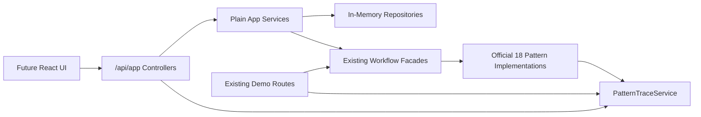

# React-Ready Backend API Plan

## Current Repository Facts
- Existing Spring Boot app is Java-only and uses in-memory repositories under `[src/main/java/edu/university/cms/repository](src/main/java/edu/university/cms/repository)`.
- Existing stable routes live in `[src/main/java/edu/university/cms/web](src/main/java/edu/university/cms/web)` and must remain unchanged: `/demo`, `/trace`, `/demo/phase-2`, `/demo/phase-3`, `/demo/phase-4`, `/demo/phase-5`.
- Official pattern catalog is `[src/main/java/edu/university/cms/domain/OfficialPattern.java](src/main/java/edu/university/cms/domain/OfficialPattern.java)` and already contains exactly 18 patterns.
- Trace source of truth is `[src/main/java/edu/university/cms/application/PatternTraceService.java](src/main/java/edu/university/cms/application/PatternTraceService.java)`.
- Submission workflow currently auto-runs analysis through `[src/main/java/edu/university/cms/application/SubmissionWorkflowFacade.java](src/main/java/edu/university/cms/application/SubmissionWorkflowFacade.java)` and `[src/main/java/edu/university/cms/application/SubmissionWorkflowMediator.java](src/main/java/edu/university/cms/application/SubmissionWorkflowMediator.java)`; the app API should introduce a separate submission creation path and a separate analysis endpoint without breaking the demo workflow.



## Cross-Phase Rules
- Do not rename, remove, or add entries to `OfficialPattern` except tests that assert it remains exactly 18.
- Do not introduce authentication, database persistence, real AI, or real secure code execution.
- Keep API classes plain Spring controllers/services/DTOs; do not present them as new design pattern implementations.
- Do not clear `PatternTraceService` from normal read endpoints. Use clearing only where existing demo routes already do it or where tests explicitly reset state.
- Every phase ends with `mvn test`, manual curl checks, and human approval before the next phase.

## Phase 1: Safety And Read-Only API Foundation

### Purpose
Create a safe API baseline for the future React app and lock down invariants before adding mutable product flows.

### Reuse
- `[src/main/java/edu/university/cms/config/SeedDataConfig.java](src/main/java/edu/university/cms/config/SeedDataConfig.java)`
- `[src/main/java/edu/university/cms/repository/UserRepository.java](src/main/java/edu/university/cms/repository/UserRepository.java)`
- `[src/main/java/edu/university/cms/domain/User.java](src/main/java/edu/university/cms/domain/User.java)`
- `[src/main/java/edu/university/cms/domain/OfficialPattern.java](src/main/java/edu/university/cms/domain/OfficialPattern.java)`
- `[src/main/java/edu/university/cms/application/PatternTraceService.java](src/main/java/edu/university/cms/application/PatternTraceService.java)`

### New Classes
- `application/AppDashboardService.java`
- `web/AppDashboardController.java`
- `web/AppUserController.java`
- `web/AppPatternController.java`
- `web/AppTraceController.java`
- DTO records: `DashboardResponse`, `UserResponse`, `PatternResponse`, `TraceEventResponse`

### Endpoints
- `GET /api/app/dashboard`
- `GET /api/app/instructor`
- `GET /api/app/students`
- `GET /api/app/patterns`
- `GET /api/app/trace`

### Expected Shapes
`GET /api/app/dashboard`
```json
{
  "instructor": { "id": "uuid", "name": "Sriram Madduri", "role": "INSTRUCTOR" },
  "counts": { "courses": 0, "students": 5, "assignments": 0, "submissions": 0, "traceEvents": 0 }
}
```

`GET /api/app/patterns`
```json
[
  { "key": "FACTORY_METHOD", "displayName": "Factory Method", "category": "CREATIONAL" }
]
```

`GET /api/app/trace`
```json
[
  {
    "timestamp": "2026-05-28T...Z",
    "userAction": "Submit assignment",
    "pattern": "FACADE",
    "patternDisplayName": "Facade",
    "category": "STRUCTURAL",
    "className": "SubmissionWorkflowFacade",
    "description": "...",
    "workflowStep": "Controller submits assignment"
  }
]
```

### Tests
- New `AppReadApiTest` using MockMvc.
- Existing routes return 200: `/demo`, `/trace`, `/demo/phase-2`, `/demo/phase-3`, `/demo/phase-4`, `/demo/phase-5`.
- `GET /api/app/patterns` returns exactly 18 and does not include Singleton.
- `GET /api/app/students` returns at least five students.
- `GET /api/app/trace` mirrors `PatternTraceService.findAll()` and contains no fake records.

### Manual Verification
```bash
mvn test
curl -s http://localhost:8080/api/app/dashboard
curl -s http://localhost:8080/api/app/instructor
curl -s http://localhost:8080/api/app/students
curl -s http://localhost:8080/api/app/patterns
curl -s http://localhost:8080/api/app/trace
curl -I http://localhost:8080/demo
curl -I http://localhost:8080/trace
```

### Risks
- Expanding seed data could disturb tests that assume one student. Avoid tests depending on exact student count except at least five.
- Trace endpoint could accidentally serialize internal enum fields differently. Use explicit DTOs.

### Rollback
Revert only Phase 1 files and restore `SeedDataConfig` if necessary. Existing demo controllers should not need rollback because they are not modified.

### Commit Message
`Add read-only app API foundation`

## Phase 2: Courses And Roster

### Purpose
Allow the seeded instructor to create multiple in-memory courses and enroll seeded students.

### Reuse
- `Course`, `User`, `UserRole`
- `CourseRepository`, `UserRepository`
- Existing command classes may be reused for course creation where helpful: `CreateCourseCommand`, `CommandInvoker`, `CommandHistory`

### New Classes
- `domain/CourseEnrollment.java`
- `repository/CourseEnrollmentRepository.java`
- `application/CourseAppService.java`
- `application/RosterAppService.java`
- `web/AppCourseController.java`
- DTOs: `CreateCourseRequest`, `CourseResponse`, `CourseDetailResponse`, `EnrollmentRequest`, `RosterResponse`

### Endpoints
- `GET /api/app/courses`
- `POST /api/app/courses`
- `GET /api/app/courses/{courseId}`
- `GET /api/app/courses/{courseId}/roster`
- `POST /api/app/courses/{courseId}/enrollments`

### Expected Shapes
`POST /api/app/courses`
```json
{ "title": "Design Patterns CS501" }
```

Response:
```json
{
  "id": "uuid",
  "title": "Design Patterns CS501",
  "instructor": { "id": "uuid", "name": "Sriram Madduri" },
  "rosterCount": 0,
  "assignmentCount": 0
}
```

`POST /api/app/courses/{courseId}/enrollments`
```json
{ "studentIds": ["uuid-1", "uuid-2"] }
```

Response:
```json
{
  "courseId": "uuid",
  "students": [
    { "id": "uuid-1", "name": "Demo Student 1", "role": "STUDENT" }
  ]
}
```

### Tests
- Instructor can create two courses.
- Enrolling the same student twice is idempotent or returns the existing roster without duplication.
- Cannot enroll an instructor as a student.
- Unknown course/student returns 404 or controlled 400.
- Existing `/demo/phase-2` behavior still passes.

### Manual Verification
```bash
mvn test
curl -s http://localhost:8080/api/app/courses
curl -s -X POST http://localhost:8080/api/app/courses -H 'Content-Type: application/json' -d '{"title":"Design Patterns CS501"}'
curl -s http://localhost:8080/api/app/courses/{courseId}
curl -s -X POST http://localhost:8080/api/app/courses/{courseId}/enrollments -H 'Content-Type: application/json' -d '{"studentIds":["student-uuid"]}'
curl -s http://localhost:8080/api/app/courses/{courseId}/roster
```

### Risks
- Current `Course` has modules but no roster. Keep enrollment separate instead of reshaping `Course` heavily.
- Course creation trace may add command events. That is acceptable only if events come from pattern classes and official patterns.

### Rollback
Remove enrollment repository/model and app course controller/service. Existing course repository and demo routes remain intact.

### Commit Message
`Add course and roster app APIs`

## Phase 3: Assignments And Rubrics

### Purpose
Support course assignment and rubric creation for the instructor-facing builder screens.

### Reuse
- `Assignment`, `Rubric`, `RubricCriterion`, `CourseModule`
- `AssignmentRepository`, `CourseRepository`
- `AssignmentBuilder`
- Existing enum types: `SubmissionType`, `GradingStrategyType`

### New Classes
- `domain/CourseAssignmentLink.java` or `repository/CourseContentIndexRepository.java`
- `application/AssignmentAppService.java`
- `web/AppAssignmentController.java`
- DTOs: `CreateAssignmentRequest`, `RubricRequest`, `RubricCriterionRequest`, `AssignmentResponse`, `RubricResponse`

### Endpoints
- `GET /api/app/courses/{courseId}/assignments`
- `POST /api/app/courses/{courseId}/assignments`
- `GET /api/app/assignments/{assignmentId}`

### Expected Shapes
`POST /api/app/courses/{courseId}/assignments`
```json
{
  "title": "Adapter Pattern Essay",
  "description": "Explain how Adapter protects the domain from external services.",
  "dueDate": "2026-06-15",
  "acceptedSubmissionTypes": ["PDF_TEXT"],
  "gradingStrategyType": "RUBRIC_WEIGHTED",
  "maxPoints": 100,
  "rubric": {
    "title": "Essay Rubric",
    "criteria": [
      { "name": "Correctness", "description": "Accurate use of pattern concepts.", "maxPoints": 50 },
      { "name": "Explanation", "description": "Clear reasoning and examples.", "maxPoints": 50 }
    ]
  }
}
```

Response:
```json
{
  "id": "uuid",
  "courseId": "uuid",
  "title": "Adapter Pattern Essay",
  "acceptedSubmissionTypes": ["PDF_TEXT"],
  "gradingStrategyType": "RUBRIC_WEIGHTED",
  "maxPoints": 100,
  "rubric": {
    "id": "uuid",
    "title": "Essay Rubric",
    "criteria": [
      { "id": "uuid", "name": "Correctness", "description": "...", "maxPoints": 50 }
    ]
  }
}
```

### Tests
- Assignment creation persists assignment and rubric.
- Course assignment list returns only assignments linked to that course.
- Invalid rubric totals or empty criteria are rejected if validation is added.
- Java assignment supports `JAVA_CODE` and `CODE_TEST`.
- `/demo/phase-2` and `/demo/phase-3` still pass.

### Manual Verification
```bash
mvn test
curl -s http://localhost:8080/api/app/courses/{courseId}/assignments
curl -s -X POST http://localhost:8080/api/app/courses/{courseId}/assignments -H 'Content-Type: application/json' -d @assignment.json
curl -s http://localhost:8080/api/app/assignments/{assignmentId}
```

### Risks
- `CourseModule` currently exposes an unmodifiable assignment list, so direct mutation is not available. Prefer a separate course-assignment index instead of invasive domain changes.
- Avoid adding persistence abstractions that imply a real database.

### Rollback
Remove assignment app service/controller and course-assignment index. Existing assignment repository and builder remain untouched.

### Commit Message
`Add assignment and rubric app APIs`

## Phase 4: Submissions And Separate Analysis

### Purpose
Let the instructor create/view/select submissions, then run mock analysis as a separate explicit UI action.

### Reuse
- `Submission`, `SubmissionStatus`, `SubmissionType`
- `SubmissionRepository`, `AssignmentRepository`, `UserRepository`
- Validation handlers from `patterns/behavioral/chain`
- State classes from `patterns/behavioral/state`
- Mock analysis stack: `DefaultAnalysisService`, `CachedAnalysisServiceProxy`, `MockAIServiceAdapter`, `MockCodeSandboxAdapter`, `GradingStrategySelector`

### New Classes
- `application/SubmissionAppService.java`
- `application/AnalysisAppService.java`
- `web/AppSubmissionController.java`
- DTOs: `CreateSubmissionRequest`, `SubmissionListItemResponse`, `SubmissionDetailResponse`, `AnalysisResponse`
- New service method that creates a submission without analysis. Do not change `SubmissionWorkflowFacade.submitAssignment()` semantics because demo routes rely on auto-analysis.

### Endpoints
- `GET /api/app/assignments/{assignmentId}/submissions`
- `POST /api/app/assignments/{assignmentId}/submissions`
- `GET /api/app/submissions/{submissionId}`
- `POST /api/app/submissions/{submissionId}/analyze`

### Expected Shapes
`POST /api/app/assignments/{assignmentId}/submissions`
```json
{
  "studentId": "uuid",
  "submissionType": "JAVA_CODE",
  "content": "public class Demo { public String explain() { return \"Adapter\"; } }"
}
```

Response before analysis:
```json
{
  "id": "uuid",
  "assignmentId": "uuid",
  "student": { "id": "uuid", "name": "Demo Student 1" },
  "type": "JAVA_CODE",
  "status": "SUBMITTED",
  "submittedAt": "2026-05-28T...Z",
  "hasAnalysisReport": false
}
```

`POST /api/app/submissions/{submissionId}/analyze`
```json
{}
```

Response after analysis:
```json
{
  "submissionId": "uuid",
  "status": "AWAITING_REVIEW",
  "report": {
    "summary": "Mock summary...",
    "rubricFindings": [],
    "testResults": [],
    "suggestedFeedback": "...",
    "gradeSuggestion": { "points": 85, "maxPoints": 100, "explanation": "..." }
  }
}
```

### Tests
- Creating a submission does not create an `AIAnalysisReport`.
- Analyze endpoint transitions `SUBMITTED -> ANALYZING -> AWAITING_REVIEW` and stores report.
- Re-analyzing can either return the existing report or run deterministically; document chosen behavior in the test. Prefer idempotent return of existing report.
- Text submissions produce rubric findings and suggested feedback.
- Java submissions produce mock test results.
- Trace events are generated by validation/state/analysis pattern classes, not fake API records.
- Existing `Phase3WorkflowTest` remains unchanged and still verifies demo auto-analysis.

### Manual Verification
```bash
mvn test
curl -s -X POST http://localhost:8080/api/app/assignments/{assignmentId}/submissions -H 'Content-Type: application/json' -d @submission.json
curl -s http://localhost:8080/api/app/assignments/{assignmentId}/submissions
curl -s http://localhost:8080/api/app/submissions/{submissionId}
curl -s -X POST http://localhost:8080/api/app/submissions/{submissionId}/analyze
curl -s http://localhost:8080/api/app/trace
```

### Risks
- Current `SubmissionWorkflowMediator` combines create and analyze. Avoid modifying it in place; add app-specific orchestration for separated actions.
- State transitions must remain valid. If `SubmittedState` requires a specific transition path, use domain methods rather than setting status directly.

### Rollback
Remove new app submission/analysis services and controller. Keep existing workflow facade/mediator intact.

### Commit Message
`Add separated submission analysis APIs`

## Phase 5: Feedback Drafts, Final Feedback, Student View

### Purpose
Expose existing Memento-backed feedback draft behavior and final feedback flow for instructor review and student feedback screens.

### Reuse
- `InstructorReviewFacade`
- `StudentFeedbackService`
- `FeedbackDraft`, `FeedbackDraftMemento`, `FeedbackDraftHistory`
- `DomainEventPublisher`, `NotificationListener`, `PatternTraceListener`
- `NotificationRepository`, `SubmissionRepository`

### New Classes
- `domain/FeedbackDraftSession.java` or app-level draft store record keyed by `submissionId`
- `repository/FeedbackDraftRepository.java` if draft history needs to survive multiple API calls in memory
- `application/FeedbackDraftAppService.java`
- `web/AppFeedbackController.java`
- DTOs: `FeedbackDraftResponse`, `SaveFeedbackDraftRequest`, `RestoreFeedbackDraftRequest`, `FinalizeFeedbackRequest`, `StudentFeedbackResponse`

### Endpoints
- `GET /api/app/submissions/{submissionId}/feedback-drafts`
- `POST /api/app/submissions/{submissionId}/feedback-drafts`
- `POST /api/app/submissions/{submissionId}/feedback-drafts/restore`
- `POST /api/app/submissions/{submissionId}/final-feedback`
- `GET /api/app/submissions/{submissionId}/student-feedback`

### Expected Shapes
`POST /api/app/submissions/{submissionId}/feedback-drafts`
```json
{ "feedbackText": "Good use of Adapter. Add one edge-case explanation." }
```

Response:
```json
{
  "submissionId": "uuid",
  "currentFeedback": "Good use of Adapter. Add one edge-case explanation.",
  "drafts": [
    { "index": 0, "feedbackText": "...", "savedAt": "2026-05-28T...Z" }
  ]
}
```

`POST /api/app/submissions/{submissionId}/feedback-drafts/restore`
```json
{ "draftIndex": 0 }
```

`POST /api/app/submissions/{submissionId}/final-feedback`
```json
{ "feedbackText": "Final instructor feedback shown to the student." }
```

Response:
```json
{
  "submissionId": "uuid",
  "status": "FINALIZED",
  "finalFeedback": "Final instructor feedback shown to the student.",
  "grade": { "points": 85, "maxPoints": 100, "explanation": "..." },
  "notificationMessage": "Feedback published..."
}
```

`GET /api/app/submissions/{submissionId}/student-feedback`
```json
{
  "submissionId": "uuid",
  "finalFeedback": "Final instructor feedback shown to the student.",
  "grade": { "points": 85, "maxPoints": 100, "explanation": "..." },
  "aiSummary": "Mock summary...",
  "notification": { "message": "Feedback published..." }
}
```

### Tests
- Saving feedback draft records Memento trace through existing memento classes.
- Restoring a draft returns the earlier text.
- Finalizing feedback moves submission to `FINALIZED`, publishes notification, and records Observer/Bridge/State traces through existing backend code.
- Student feedback endpoint fails clearly before finalization and succeeds after finalization.
- `/demo/phase-5` remains stable.

### Manual Verification
```bash
mvn test
curl -s http://localhost:8080/api/app/submissions/{submissionId}/feedback-drafts
curl -s -X POST http://localhost:8080/api/app/submissions/{submissionId}/feedback-drafts -H 'Content-Type: application/json' -d '{"feedbackText":"First draft"}'
curl -s -X POST http://localhost:8080/api/app/submissions/{submissionId}/feedback-drafts -H 'Content-Type: application/json' -d '{"feedbackText":"Second draft"}'
curl -s -X POST http://localhost:8080/api/app/submissions/{submissionId}/feedback-drafts/restore -H 'Content-Type: application/json' -d '{"draftIndex":0}'
curl -s -X POST http://localhost:8080/api/app/submissions/{submissionId}/final-feedback -H 'Content-Type: application/json' -d '{"feedbackText":"Final feedback"}'
curl -s http://localhost:8080/api/app/submissions/{submissionId}/student-feedback
```

### Risks
- Existing `InstructorReviewFacade.reviewAndFinalize()` currently performs draft edits and finalization in one call. For multi-step APIs, use existing memento classes directly in a new app service rather than forcing one-call facade behavior.
- Draft history is in-memory and will reset on restart. That is acceptable for MVP and should be documented.

### Rollback
Remove feedback app service/controller/draft repository. Existing phase-5 facade and demo route remain unchanged.

### Commit Message
`Add feedback draft and finalization APIs`

## Phase 6: Trace Polish

### Purpose
Make the trace endpoint React-ready with filters while preserving `PatternTraceService` as the only trace source.

### Reuse
- `PatternTraceService`
- `PatternTraceEvent`
- `OfficialPattern`, `PatternCategory`
- Filtering behavior from existing `[src/main/java/edu/university/cms/web/TraceController.java](src/main/java/edu/university/cms/web/TraceController.java)`

### New Classes
- Extend `AppTraceController`
- Optional `TraceQuery` record

### Endpoints
- `GET /api/app/trace?category=&pattern=&workflowStep=&search=`

### Expected Shape
```json
{
  "events": [
    {
      "timestamp": "2026-05-28T...Z",
      "userAction": "Run mock analysis",
      "pattern": "ADAPTER",
      "patternDisplayName": "Adapter",
      "category": "STRUCTURAL",
      "className": "MockAIServiceAdapter",
      "description": "...",
      "workflowStep": "Mock AI analysis"
    }
  ],
  "filters": {
    "category": "STRUCTURAL",
    "pattern": null,
    "workflowStep": null,
    "search": "adapter"
  }
}
```

### Tests
- Filter by `category`.
- Filter by `pattern` enum key and/or display name.
- Filter by `workflowStep`.
- Search across user action, pattern display name, class name, description, workflow step.
- No endpoint creates fake trace events.
- Existing `/trace` HTML still works.

### Manual Verification
```bash
mvn test
curl -s 'http://localhost:8080/api/app/trace?category=STRUCTURAL'
curl -s 'http://localhost:8080/api/app/trace?pattern=Adapter'
curl -s 'http://localhost:8080/api/app/trace?search=mock'
curl -s http://localhost:8080/trace
```

### Risks
- Filtering by display name can be case-sensitive if not normalized. Normalize input safely.
- Search should be read-only and should not clear or mutate trace state.

### Rollback
Revert only `AppTraceController` filter changes and related tests. Basic Phase 1 trace endpoint can remain.

### Commit Message
`Add filtered app trace API`

## Phase 7: React Setup Plan Only

### Purpose
Prepare for a later React frontend without implementing it in this backend phase set.

### Reuse
- Visual reference from `figma/interactive-app/screenshots/` when available.
- Existing Figma export under `[figma/Untitled](figma/Untitled)` can inform component names and layout, but should not become the source of backend data or trace fixtures.
- All `/api/app` endpoints from Phases 1-6.

### Planned Frontend Structure
- Add a future `frontend/` Vite React app or move the generated Figma app into a clean `frontend/` package after backend APIs stabilize.
- Frontend routes should map to final screens:
  - Dashboard: `GET /api/app/dashboard`
  - Courses list: `GET /api/app/courses`
  - Course builder: `POST /api/app/courses`, `POST /api/app/courses/{courseId}/assignments`
  - Student roster: `GET/POST /api/app/courses/{courseId}/enrollments`
  - Assignments: `GET /api/app/courses/{courseId}/assignments`
  - Submissions: `GET /api/app/assignments/{assignmentId}/submissions`, `POST /api/app/submissions/{submissionId}/analyze`
  - Student feedback: `GET /api/app/submissions/{submissionId}/student-feedback`
  - Full trace: `GET /api/app/trace?...`

### Rules For React Later
- React does not contain design-pattern implementations.
- React does not synthesize trace events.
- React renders only API state and sends user actions to the backend.
- No authentication UI beyond selecting seeded users if needed for demo convenience.
- No backend flow or existing demo link screens, per scope removal.

### Tests Later
- Frontend smoke tests for each route after React is added.
- API contract tests should stay in Spring Boot and remain the source of truth.

### Manual Verification Later
```bash
mvn test
npm test
npm run build
```

### Risks
- Generated Figma code may include hardcoded sample data. Replace sample data with API calls during React implementation.
- Do not let the frontend become a second workflow engine.

### Rollback
Since Phase 7 is planning only, rollback is not applicable. When React is later implemented, keep it in a separate commit from backend API phases.

### Commit Message
`Document React integration plan`

## Final Acceptance Checklist
- `mvn test` passes after every phase.
- Existing stable routes still work after every phase.
- `/api/app/patterns` exposes exactly the official 18 patterns.
- No Singleton is introduced.
- No database, auth, real AI, or real secure code execution is introduced.
- Submission creation and analysis are separate API actions.
- Pattern trace events are sourced only from `PatternTraceService`.
- React implementation is deferred until backend API phases are reviewed and approved.